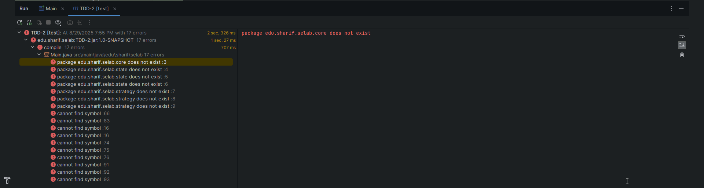
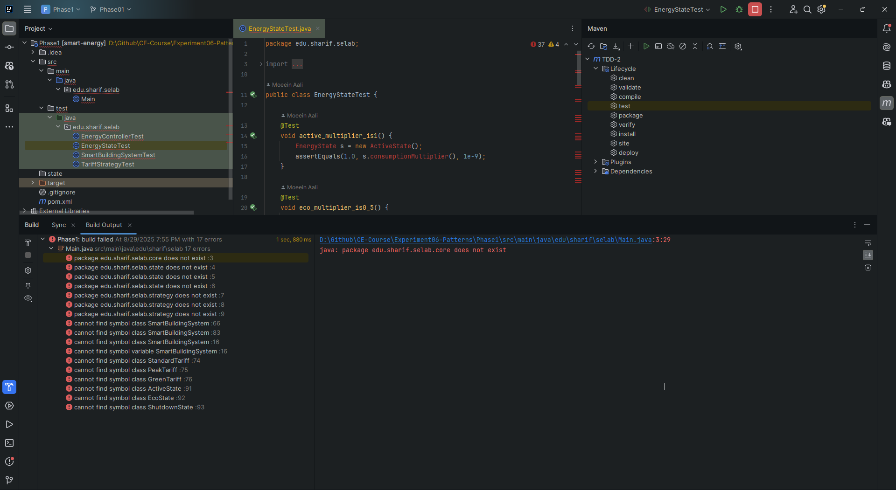
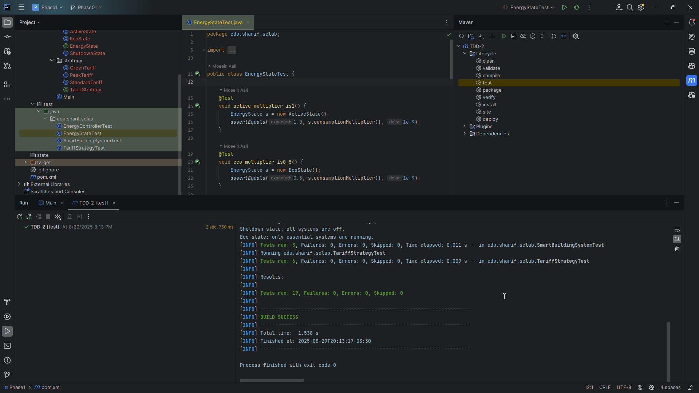
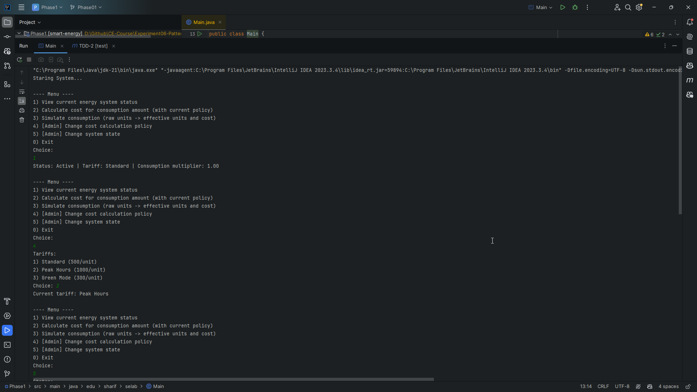
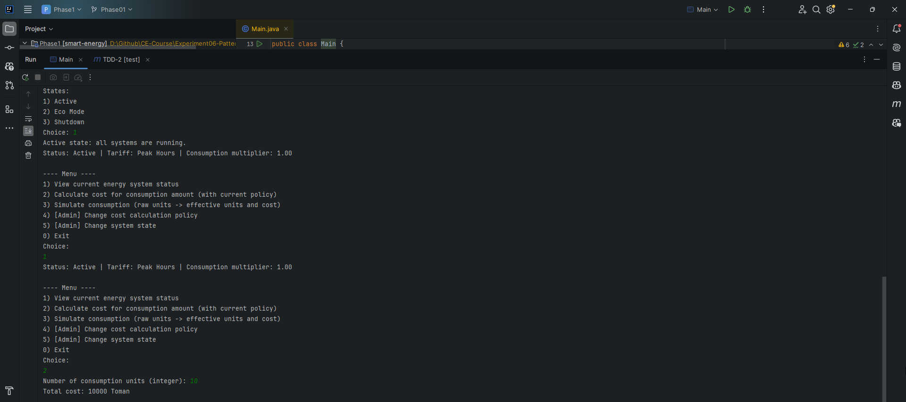
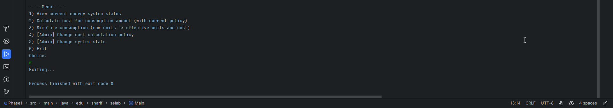
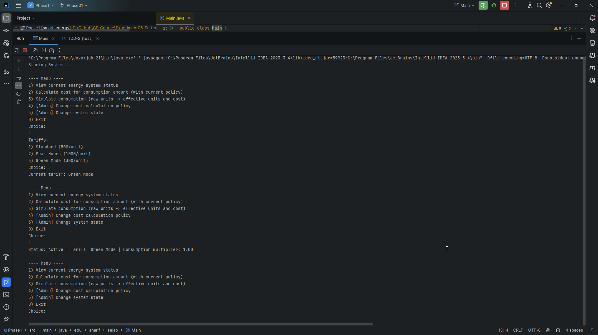

# الگو‌های طراحی و بازآرایی کد

## فاز اول - سیستم مدیریت پویای مصرف انرژی هوشمند در یک ساختمان

در این فاز قرار است با رویکرد
`TDD`
پروژه را پیاده‌سازی کنیم.

تست‌ها را داخل پوشه مربوطه می‌سازیم:

```java
public class TariffStrategyTest {

    @Test
    void standardTariff_cost_is500PerUnit() {
        TariffStrategy t = new StandardTariff();
        assertEquals(5000L, t.cost(10));
    }

    @Test
    void peakTariff_cost_is1000PerUnit() {
        TariffStrategy t = new PeakTariff();
        assertEquals(3000L, t.cost(3));
    }

    @Test
    void greenTariff_cost_is300PerUnit() {
        TariffStrategy t = new GreenTariff();
        assertEquals(3000L, t.cost(10));
    }

    @Test
    void standard_is_500_per_unit() {
        TariffStrategy t = new StandardTariff();
        assertEquals(500L, t.cost(1));
        assertEquals(5000L, t.cost(10));
        assertEquals("Standard", t.name());
    }

    @Test
    void peak_is_1000_per_unit() {
        TariffStrategy t = new PeakTariff();
        assertEquals(1000L, t.cost(1));
        assertEquals(7000L, t.cost(7));
        assertEquals("Peak Hours", t.name());
    }

    @Test
    void green_is_300_per_unit_and_handles_zero() {
        TariffStrategy t = new GreenTariff();
        assertEquals(0L, t.cost(0));
        assertEquals(3000L, t.cost(10));
        assertEquals("Green Mode", t.name());
    }
}
```

```java
public class EnergyStateTest {

    @Test
    void active_multiplier_is1() {
        EnergyState s = new ActiveState();
        assertEquals(1.0, s.consumptionMultiplier(), 1e-9);
    }

    @Test
    void eco_multiplier_is0_5() {
        EnergyState s = new EcoState();
        assertEquals(0.5, s.consumptionMultiplier(), 1e-9);
    }

    @Test
    void shutdown_multiplier_is0() {
        EnergyState s = new ShutdownState();
        assertEquals(0.0, s.consumptionMultiplier(), 1e-9);
    }


    @Test
    void active_has_name_and_message() {
        EnergyState s = new ActiveState();
        assertEquals("Active", s.name());
        assertNotNull(s.enterMessage());
        assertTrue(s.enterMessage().contains("Active"));
    }

    @Test
    void eco_has_name_and_message() {
        EnergyState s = new EcoState();
        assertEquals("Eco Mode", s.name());
        assertNotNull(s.enterMessage());
        assertTrue(s.enterMessage().contains("Eco"));
    }

    @Test
    void shutdown_has_name_and_message() {
        EnergyState s = new ShutdownState();
        assertEquals("Shutdown", s.name());
        assertNotNull(s.enterMessage());
        assertTrue(s.enterMessage().contains("Shutdown"));
    }

    @Test
    void multipliers_within_0_and_1_and_ordered() {
        EnergyState active = new ActiveState();
        EnergyState eco = new EcoState();
        EnergyState shutdown = new ShutdownState();

        double a = active.consumptionMultiplier();
        double e = eco.consumptionMultiplier();
        double z = shutdown.consumptionMultiplier();

        assertTrue(0.0 <= a && a <= 1.0);
        assertTrue(0.0 <= e && e <= 1.0);
        assertTrue(0.0 <= z && z <= 1.0);

        assertTrue(a >= e, "Active باید >= Eco باشد");
        assertTrue(e >= z, "Eco باید >= Shutdown باشد");
    }
}
```

```java
public class SmartBuildingSystemTest {

    @Test
    void active_standard_10units_cost_5000() {
        SmartBuildingSystem sys = SmartBuildingSystem.defaultSystem();
        assertEquals(5000L, sys.simulateCost(10));
        assertEquals(10L, sys.adjustedUnits(10));
    }

    @Test
    void eco_green_10units_cost_1500() {
        SmartBuildingSystem sys = SmartBuildingSystem.defaultSystem();
        sys.setState(new EcoState());
        sys.setTariff(new GreenTariff());
        assertEquals(5L, sys.adjustedUnits(10));
        assertEquals(1500L, sys.simulateCost(10));
    }

    @Test
    void shutdown_anyTariff_cost_zero() {
        SmartBuildingSystem sys = SmartBuildingSystem.defaultSystem();
        sys.setState(new ShutdownState());
        assertEquals(0L, sys.adjustedUnits(100));
        assertEquals(0L, sys.simulateCost(100));
    }
}
```

```java
public class EnergyControllerTest {

    @Test
    void initial_state_reflected_in_status_and_multiplier() {
        EnergyController controller = new EnergyController(new ActiveState());
        assertEquals("Active", controller.status());
        assertEquals(1.0, controller.multiplier(), 1e-9);
    }

    @Test
    void changing_to_eco_updates_status_and_multiplier() {
        EnergyController controller = new EnergyController(new ActiveState());
        controller.setState(new EcoState());
        assertEquals("Eco Mode", controller.status());
        assertEquals(0.5, controller.multiplier(), 1e-9);
    }

    @Test
    void changing_to_shutdown_updates_status_and_multiplier() {
        EnergyController controller = new EnergyController(new ActiveState());
        controller.setState(new ShutdownState());
        assertEquals("Shutdown", controller.status());
        assertEquals(0.0, controller.multiplier(), 1e-9);
    }
}
```

در ابتدا که تست‌ها را اجرا می‌کنیم هیچ کدام پاس نمی‌شوند:





حال رفته‌رفته پروژه را پیاده‌سازی می‌کنیم تا تست‌ها پاس شوند.

ساختار پروژه:

```
├── pom.xml
├── README.md
└── src
    ├── main
    │   └── java
    │       └── edu
    │           └── sharif
    │               └── selab
    │                   ├── App.java
    │                   ├── core
    │                   │   ├── BillingService.java
    │                   │   ├── EnergyController.java
    │                   │   └── SmartBuildingSystem.java
    │                   ├── state
    │                   │   ├── EnergyState.java
    │                   │   ├── ActiveState.java
    │                   │   ├── EcoState.java
    │                   │   └── ShutdownState.java
    │                   └── strategy
    │                       ├── TariffStrategy.java
    │                       ├── StandardTariff.java
    │                       ├── PeakTariff.java
    │                       └── GreenTariff.java
    └── test
        └── java
            └── edu
                └── sharif
                    └── selab
                        ├── EnergyStateTest.java
                        ├── EnergyStateNamingAndMessageTest.java
                        ├── EnergyStateInvariantTest.java
                        ├── EnergyControllerTest.java
                        ├── SmartBuildingSystemIntegrationTest.java
                        └── TariffStrategyTest.java
```

### توضیحات هر بخش:

- Main.java → نقطه‌ی شروع (منوی کنسولی)
- core/ → بخش Context (مدیریت state + strategy)

- state/ → پیاده‌سازی الگوی State (Active, Eco, Shutdown)

- strategy/ → پیاده‌سازی الگوی Strategy (Standard, Peak, Green)

- test/ → تست‌های JUnit5 برای هر بخش، مطابق TDD

- pom.xml → مدیریت وابستگی‌ها (JUnit, plugins, ...)

### توضیحات الگوی طراحی

در این پروژه ما دو الگوی طراحی اصلی داریم: `Strategy` و `State`. هر کدام هدف و کاربرد متفاوتی دارند ولی با هم ترکیب می‌شوند تا سیستم انعطاف‌پذیر و قابل توسعه باشد.

#### الگوی Strategy

الگوی `Strategy` برای جداسازی منطق محاسبه هزینه‌ی انرژی از بقیه‌ی سیستم استفاده شده است. در این پروژه، کلاس‌های مختلفی مثل `StandardTariff`, `PeakTariff`, و `GreenTariff` همگی یک اینترفیس مشترک به نام `TariffStrategy` را پیاده‌سازی می‌کنند. این کار باعث می‌شود که نحوه‌ی محاسبه‌ی هزینه (هر واحد ۵۰۰، ۱۰۰۰ یا ۳۰۰ تومان) به‌صورت قابل تعویض در زمان اجرا باشد. یعنی بدون تغییر در منطق اصلی سیستم، مدیر ساختمان می‌تواند سیاست تعرفه را تغییر دهد. مزیت این الگو این است که اگر در آینده تعرفه‌های جدیدی اضافه شوند (مثلاً «تعرفه آخر هفته»)، کافی است یک کلاس جدید ایجاد شود، بدون آنکه نیاز به تغییر در سایر بخش‌ها باشد.

#### الگوی State

الگوی State برای مدیریت وضعیت سیستم انرژی ساختمان به کار رفته است. سیستم می‌تواند در حالت‌های مختلفی باشد: `ActiveState`, `EcoState`, و `ShutdownState`. هر حالت رفتار خاص خودش را دارد (مثلاً ضریب مصرف ۱، ۰.۵ یا ۰) و پیام متفاوتی هنگام فعال شدن چاپ می‌کند. به‌جای نوشتن شرط‌های پیچیده (`if/else` یا `switch`) در کد اصلی، هر حالت به‌صورت یک کلاس مستقل پیاده‌سازی شده و منطق مربوط به خودش را دارد. این باعث می‌شود تغییر یا اضافه کردن حالت جدید خیلی ساده‌تر باشد و کد اصلی تمیز و قابل نگهداری باقی بماند.

#### پیاده‌سازی State

اینترفیس مربوط به این بخش به این صورت است:

```java
public interface EnergyState {
    String name();

    double consumptionMultiplier();

    String enterMessage();
}
```

حالت‌هایی که این اینترفیس implement می‌شود:

وضعیت فعال:

```java
public final class ActiveState implements EnergyState {
    @Override
    public String name() {
        return "Active";
    }

    @Override
    public double consumptionMultiplier() {
        return 1.0;
    }

    @Override
    public String enterMessage() {
        return "Active state: all systems are running.";
    }
}
```

وضعیت Eco:

```java
public final class EcoState implements EnergyState {
    @Override
    public String name() {
        return "Eco Mode";
    }

    @Override
    public double consumptionMultiplier() {
        return 0.5;
    }

    @Override
    public String enterMessage() {
        return "Eco state: only essential systems are running.";
    }

}
```

وضعیت خاموش:

```java
public final class ShutdownState implements EnergyState {
    @Override
    public String name() {
        return "Shutdown";
    }

    @Override
    public double consumptionMultiplier() {
        return 0.0;
    }

    @Override
    public String enterMessage() {
        return "Shutdown state: all systems are off.";
    }
}
```

#### پیاده‌سازی Strategy

اینترفیس مربوط به این بخش:

```java
public interface TariffStrategy {
    long cost(long units);

    String name();
}
```

و پیاده‌سازی‌های آن:

```java
public final class StandardTariff implements TariffStrategy {
    @Override
    public long cost(long units) {
        return units * 500L;
    }

    @Override
    public String name() {
        return "Standard";
    }
}

```

```java
public final class PeakTariff implements TariffStrategy {
    @Override
    public long cost(long units) {
        return units * 1000L;
    }

    @Override
    public String name() {
        return "Peak Hours";
    }
}
```

```java
public final class GreenTariff implements TariffStrategy {
    @Override
    public long cost(long units) {
        return units * 300L;
    }

    @Override
    public String name() {
        return "Green Mode";
    }
}
```

سپس Menu ها و ماژول
Core
را هم پیاده‌سازی می‌کنیم که داخل سورس پروژه موجود است.

حال تست‌ها را با دستور زیر اجرا می‌کنیم:

```
maven test
```

می‌بینیم که همه‌ی تست‌های ما به درستی پاس شدند و برنامه درست کار می‌کند:



مستندات اجرای صحیح پروژه:









---

## پاسخ به سوالات انتهایی دستورکار

### سوال اول | در کتاب GoF سه دسته الگوی طراحی معرفی شده است. آنها را نام ببرید و در مورد هر دسته در حد دو خط توضیح دهید و برای هر دسته دو نمونه الگو متعلق به آن دسته را نام ببرید.

### ۱. الگوهای ایجادی (Creational Patterns)

این دسته از الگوها به فرآیند ایجاد اشیاء (objects) مربوط می‌شوند و تلاش می‌کنند تا پیچیدگی‌های ساخت اشیاء را کاهش داده و فرآیند آن را ساده‌تر و انعطاف‌پذیرتر کنند. این الگوها با پنهان کردن منطق ایجاد اشیاء، به سیستم استقلال بیشتری در مورد نحوه ایجاد، ترکیب و نمایش اشیاء می‌بخشند.

**مثال‌ها:**

- **Singleton (تک نمونه):** این الگو تضمین می‌کند که از یک کلاس تنها یک نمونه (instance) ساخته شود و یک نقطه دسترسی سراسری برای آن فراهم می‌کند.
- **Factory Method (متد کارخانه‌ای):** این الگو یک رابط برای ایجاد اشیاء در یک ابرکلاس (superclass) تعریف می‌کند، اما به زیرکلاس‌ها (subclasses) اجازه می‌دهد تا نوع شیءای که ایجاد می‌شود را تغییر دهند.

### ۲. الگوهای ساختاری (Structural Patterns)

الگوهای ساختاری با نحوه ترکیب کلاس‌ها و اشیاء برای تشکیل ساختارهای بزرگتر سروکار دارند. این الگوها با شناسایی روابط ساده بین موجودیت‌ها، به ساده‌سازی ساختار و افزایش کارایی و انعطاف‌پذیری آن کمک می‌کنند.

**مثال‌ها:**

- **Adapter (آداپتور):** این الگو به اشیائی با رابط‌های ناسازگار اجازه می‌دهد تا با یکدیگر همکاری کنند.
- **Decorator (تزئین‌گر):** این الگو به شما امکان می‌دهد تا با قرار دادن اشیاء در داخل کلاس‌های بسته‌بندی خاص، قابلیت‌های جدیدی را به صورت پویا به آن‌ها اضافه کنید.

### ۳. الگوهای رفتاری (Behavioral Patterns)

این دسته از الگوها بر روی الگوریتم‌ها و تخصیص مسئولیت‌ها بین اشیاء تمرکز دارند. آن‌ها نه تنها الگوهای ارتباطی بین اشیاء را توصیف می‌کنند، بلکه نحوه توزیع مسئولیت‌ها و کنترل جریان‌های پیچیده را نیز مدیریت می‌کنند.

**مثال‌ها:**

- **Observer (ناظر):** این الگو یک مکانیزم اشتراک تعریف می‌کند که به چندین شیء اجازه می‌دهد تا در مورد هر رویدادی که برای شیء مورد مشاهده آن‌ها رخ می‌دهد، مطلع شوند.
- **Strategy (استراتژی):** این الگو به شما اجازه می‌دهد تا خانواده‌ای از الگوریتم‌ها را تعریف کرده، هر یک را در یک کلاس جداگانه قرار دهید و اشیاء آن‌ها را قابل تعویض کنید.

---

### سوال دوم | الگوهای استفاده شده در فاز اول آزمایش جزو کدام دسته الگوی طراحی هستند؟

#### الگوهای Strategy و State در دسته الگوهای رفتاری (Behavioral Patterns) قرار می‌گیرند.

هر دوی این الگوها به نحوه تعامل و ارتباط بین اشیاء می‌پردازند و هدفشان افزایش انعطاف‌پذیری در نحوه انجام عملیات در زمان اجرا است.

- **الگوی Strategy (استراتژی):** این الگو به شما اجازه می‌دهد تا خانواده‌ای از الگوریتم‌ها را تعریف کرده، هر یک را در یک کلاس جداگانه قرار دهید و آن‌ها را در زمان اجرا قابل تعویض کنید. به عبارت دیگر، الگوی استراتژی بر روی "چگونگی" انجام یک کار تمرکز دارد.

- **الگوی State (وضعیت):** این الگو به یک شیء اجازه می‌دهد تا رفتار خود را با تغییر وضعیت داخلی‌اش تغییر دهد. این الگو بر روی "چیستی" وضعیت یک شیء و رفتار متناسب با آن وضعیت تمرکز می‌کند.

اگرچه ساختار این دو الگو بسیار شبیه به هم است، اما هدف و کاربرد آن‌ها متفاوت است. الگوی Strategy معمولاً توسط کلاینت (client) برای انتخاب یک الگوریتم مشخص به کار می‌رود، در حالی که در الگوی State، خود شیء (context) وضعیت داخلی خود را مدیریت کرده و رفتار خود را بر اساس آن تغییر می‌دهد.

---

### سوال سوم | با توجه به اینکه در سیستم مدیریت پویای مصرف انرژی هوشمند در یک ساختمان اداری، در هر زمان سیستم دقیقاً در یکی از سه حالت `Active`، `Eco Mode` یا `Shutdown` قرار دارد و سیاست محاسبه هزینه نیز می‌تواند بین تعرفه‌های `Standard`، `Peak Hours` یا `Green Mode` تغییر کند، کدام الگوی طراحی برای مدیریت این تغییرات حالت و سیاست‌ها مناسب‌تر است؟ ضمن بیان دلایل انتخاب الگوی طراحی، نحوه پیاده‌سازی آن را با توجه به مشخصات سیستم (شامل تغییر وضعیت سیستم، تغییر سیاست محاسبه هزینه، مشاهده وضعیت و محاسبه هزینه) به طور کامل توضیح دهید.

با توجه به مشخصات سیستم مدیریت هوشمند انرژی، بهترین رویکرد استفاده از **ترکیب دو الگوی طراحی State و Strategy** است. این دو الگو هر کدام بخشی از نیازمندی‌های سیستم را به بهترین شکل پوشش می‌دهند و با همکاری یکدیگر، یک راه‌حل انعطاف‌پذیر و قابل توسعه ایجاد می‌کنند.

در ادامه دلایل انتخاب و نحوه پیاده‌سازی کامل آن شرح داده می‌شود.

### دلایل انتخاب الگوهای طراحی

#### ۱. الگوی وضعیت (State Pattern) برای مدیریت وضعیت سیستم

سیستم در هر لحظه دقیقاً در یکی از سه حالت `Active`، `Eco Mode` یا `Shutdown` قرار دارد. رفتار کلی سیستم، مانند میزان مصرف انرژی، قوانین عملکردی و انتقال به وضعیت‌های دیگر، به شدت به حالت فعلی آن وابسته است.

**دلایل انتخاب:**

- **کپسوله‌سازی رفتار وابسته به وضعیت:** به جای استفاده از دستورات شرطی طولانی و تو در تو (if/else یا switch) در کلاس اصلی برای مدیریت رفتار در هر وضعیت، الگوی State این منطق را به کلاس‌های مجزا برای هر وضعیت منتقل می‌کند. این کار کد را تمیزتر، خواناتر و قابل مدیریت‌تر می‌کند.
- **پایبندی به اصل Open/Closed:** اگر در آینده وضعیت جدیدی مانند `Maintenance Mode` به سیستم اضافه شود، کافی است یک کلاس وضعیت جدید ایجاد کنیم بدون اینکه نیازی به تغییر کد کلاس اصلی سیستم (Context) یا وضعیت‌های دیگر باشد.
- **مدیریت آسان انتقال وضعیت‌ها:** هر کلاس وضعیت می‌تواند مسئولیت انتقال به وضعیت بعدی را بر عهده بگیرد. برای مثال، وضعیت `Active` می‌تواند بر اساس یک رویداد (مانند عدم حضور افراد) تصمیم بگیرد که سیستم را به وضعیت `Eco Mode` منتقل کند.

#### ۲. الگوی استراتژی (Strategy Pattern) برای مدیریت سیاست محاسبه هزینه

سیاست محاسبه هزینه (`Standard`، `Peak Hours` یا `Green Mode`) یک الگوریتم است که می‌تواند مستقل از وضعیت فعلی سیستم تغییر کند. برای مثال، سیستم می‌تواند در وضعیت `Active` باشد و هزینه آن بر اساس تعرفه `Peak Hours` یا `Standard` محاسبه شود.

**دلایل انتخاب:**

- **کپسوله‌سازی الگوریتم‌ها:** الگوی استراتژی به شما اجازه می‌دهد تا هر یک از الگوریتم‌های محاسبه هزینه را در کلاس جداگانه‌ای قرار دهید.
- **قابلیت تعویض در زمان اجرا:** این الگو به سیستم اجازه می‌دهد تا سیاست محاسبه هزینه را به صورت پویا و در زمان اجرا تغییر دهد، بدون اینکه نیازی به تغییر در کلاسی باشد که از این سیاست استفاده می‌کند.
- **جداسازی دغدغه‌ها (Separation of Concerns):** منطق مدیریت وضعیت سیستم از منطق محاسبه هزینه کاملاً جدا می‌شود. کلاس سیستم اصلی نگران "چگونگی" محاسبه هزینه نیست، بلکه فقط این وظیفه را به شیء استراتژی فعلی واگذار می‌کند.

### نحوه پیاده‌سازی کامل

در اینجا یک طرح کلی از نحوه پیاده‌سازی این سیستم با استفاده از ترکیب دو الگو ارائه می‌شود.

#### گام اول: تعریف رابط‌ها (Interfaces)

```csharp
public interface ISystemState
{
    void EnterState(EnergyManagementSystem system);
    void Execute(EnergyManagementSystem system);
    string GetStateName();
}

public interface ICostCalculationStrategy
{
    double CalculateCost(double energyConsumed);
    string GetPolicyName();
}
```

این بخش، قراردادهای (interfaces) اصلی را تعریف می‌کند. `ISystemState` متدهایی را مشخص می‌کند که هر کلاس وضعیت باید پیاده‌سازی کند (مانند ورود به وضعیت و اجرای رفتار آن) و `ICostCalculationStrategy` رابط مربوط به الگوریتم‌های محاسبه هزینه را تعریف می‌کند.

#### گام دوم: پیاده‌سازی کلاس‌های وضعیت (Concrete States)

```csharp
public class ActiveState : ISystemState
{
    public void EnterState(EnergyManagementSystem system) { }
    public void Execute(EnergyManagementSystem system) { }
    public string GetStateName() => "Active";
}

public class EcoModeState : ISystemState
{
    public void EnterState(EnergyManagementSystem system) { }
    public void Execute(EnergyManagementSystem system) { }
    public string GetStateName() => "Eco Mode";
}

public class ShutdownState : ISystemState
{
    public void EnterState(EnergyManagementSystem system) { }
    public void Execute(EnergyManagementSystem system) { }
    public string GetStateName() => "Shutdown";
}
```

در این قسمت، کلاس‌های مربوط به هر یک از وضعیت‌های سیستم (`Active`، `Eco Mode` و `Shutdown`) پیاده‌سازی شده‌اند. هر کلاس مسئول تعریف رفتار خاص سیستم در آن وضعیت مشخص است.

#### گام سوم: پیاده‌سازی کلاس‌های استراتژی (Concrete Strategies)

```csharp
public class StandardTariffStrategy : ICostCalculationStrategy
{
    public double CalculateCost(double energyConsumed) => energyConsumed * 0.15;
    public string GetPolicyName() => "Standard";
}

public class PeakHoursTariffStrategy : ICostCalculationStrategy
{
    public double CalculateCost(double energyConsumed) => energyConsumed * 0.25;
    public string GetPolicyName() => "Peak Hours";
}

public class GreenModeTariffStrategy : ICostCalculationStrategy
{
    public double CalculateCost(double energyConsumed) => energyConsumed * 0.12;
    public string GetPolicyName() => "Green Mode";
}
```

این کدها کلاس‌های مربوط به سیاست‌های مختلف محاسبه هزینه را پیاده‌سازی می‌کنند. هر کلاس (`StandardTariffStrategy`، `PeakHoursTariffStrategy` و `GreenModeTariffStrategy`) شامل منطق محاسباتی منحصر به فرد خود است.

#### گام چهارم: ایجاد کلاس اصلی سیستم (Context Class)

```csharp
public class EnergyManagementSystem
{
    private ISystemState _currentState;
    private ICostCalculationStrategy _currentCostStrategy;

    public EnergyManagementSystem()
    {
        _currentState = new ShutdownState();
        _currentCostStrategy = new StandardTariffStrategy();
    }

    public void ChangeState(ISystemState newState)
    {
        _currentState = newState;
        _currentState.EnterState(this);
    }

    public void SetCostCalculationPolicy(ICostCalculationStrategy newStrategy)
    {
        _currentCostStrategy = newStrategy;
    }

    public string GetCurrentStateName() => _currentState.GetStateName();
    public string GetCurrentPolicyName() => _currentCostStrategy.GetPolicyName();

    public void PerformOperations()
    {
        _currentState.Execute(this);
    }

    public double GetCurrentCost(double energyConsumed)
    {
        return _currentCostStrategy.CalculateCost(energyConsumed);
    }
}
```

این کلاس اصلی سیستم (Context) است که وضعیت و استراتژی فعلی را نگهداری می‌کند. این کلاس متدهایی برای تغییر وضعیت (`ChangeState`)، تغییر سیاست هزینه (`SetCostCalculationPolicy`)، اجرای عملیات متناسب با وضعیت فعلی (`PerformOperations`) و محاسبه هزینه بر اساس استراتژی فعلی (`GetCurrentCost`) فراهم می‌کند.

### جمع‌بندی نحوه عملکرد

- **تغییر وضعیت سیستم:** برای تغییر وضعیت، متد `ChangeState` از کلاس `EnergyManagementSystem` را با یک نمونه از وضعیت جدید (مثلاً `new ActiveState()`) فراخوانی می‌کنیم. این کار باعث می‌شود رفتار سیستم در فراخوانی‌های بعدی متد `PerformOperations` تغییر کند.
- **تغییر سیاست هزینه:** برای تغییر تعرفه، متد `SetCostCalculationPolicy` را با یک نمونه از استراتژی جدید (مثلاً `new PeakHoursTariffStrategy()`) فراخوانی می‌کنیم. این تغییر بلافاصله در محاسبات بعدی هزینه از طریق متد `GetCurrentCost` اعمال می‌شود.
- **مشاهده وضعیت:** با فراخوانی متدهای `GetCurrentStateName` و `GetCurrentPolicyName` می‌توان به راحتی وضعیت و سیاست فعلی را برای نمایش در داشبورد یا گزارش‌گیری مشاهده کرد.
- **محاسبه هزینه:** کلاس `EnergyManagementSystem` مسئولیت محاسبه هزینه را به طور کامل به شیء استراتژی فعلی خود **واگذار (Delegate)** می‌کند. این جداسازی، هسته اصلی الگوی Strategy است.

---

### سوال چهارم | تحقق و یا عدم تحقق هر کدام از اصول `SOLID` را در خصوص الگوی طراحی `Factory Method` بیان کنید (هر کدام حداکثر در سه خط)

#### ۱. اصل مسئولیت واحد (Single-Responsibility Principle - SRP)

**بله، این اصل رعایت می‌شود.**
این الگو مسئولیت ایجاد اشیاء را از کلاس اصلی (Creator) به زیرکلاس‌هایش (Concrete Creators) منتقل می‌کند. به این ترتیب، کلاس اصلی تنها یک دلیل برای تغییر دارد (منطق کسب‌وکار) و هر زیرکلاس نیز دلیل مجزای خود را برای تغییر دارد (ایجاد یک محصول خاص).

#### ۲. اصل باز/بسته (Open/Closed Principle - OCP)

**بله، این اصل به طور کامل پشتیبانی می‌شود.**
برای افزودن یک محصول جدید، نیازی به تغییر کد موجود در کلاس Creator یا کدی که از آن استفاده می‌کند نیست. تنها کافی است یک کلاس محصول جدید و یک کلاس سازنده (Creator) جدید برای آن ایجاد کنیم و به این ترتیب سیستم برای توسعه باز و برای تغییر بسته است.

#### ۳. اصل جایگزینی لیسکوف (Liskov Substitution Principle - LSP)

**بله، این الگو بر پایه این اصل کار می‌کند.**
کد کلاینت با رابط والد (Creator) کار می‌کند و انتظار یک محصول با رابط `Product` را دارد. از آنجایی که تمام محصولات واقعی (Concrete Products) از این رابط پیروی می‌کنند، می‌توان آن‌ها را بدون مشکل جایگزین یکدیگر کرد و عملکرد صحیح برنامه حفظ می‌شود.

#### ۴. اصل تفکیک رابط (Interface Segregation Principle - ISP)

**بله، این اصل رعایت می‌شود.**
الگوی متد کارخانه‌ای به خودی خود باعث نقض این اصل نمی‌شود. این الگو بر یک رابط محصول (`Product`) تکیه دارد و اگر این رابط به درستی و به صورت تفکیک‌شده طراحی شده باشد، اصل ISP نیز به طور کامل رعایت خواهد شد.

#### ۵. اصل وارونگی وابستگی (Dependency Inversion Principle - DIP)

**بله، این اصل یکی از اهداف اصلی این الگو است.**
کلاس سطح بالا (Creator) به ماژول‌های سطح پایین (Concrete Products) وابسته نیست. در عوض، هر دو به یک انتزاع (Abstraction) که همان رابط `Product` است، وابسته‌اند. این الگو وابستگی‌ها را معکوس کرده و اتصال سست (Loose Coupling) را ترویج می‌دهد.
